# সংগতি (Shongoti) — Evidence-First Financial Operating System & Multi-Agent AI Workbench for MSMEs

> **Current Verified Workflow Status (23 November 2026):**
> - **Real Workflow Handoff & Tracker:** Read **[docs/REAL_WORKFLOW_HANDOFF.md](docs/REAL_WORKFLOW_HANDOFF.md)**, **[docs/real-workflow-progress.json](docs/real-workflow-progress.json)**, and **[JR-04 Local Verification Report](docs/evidence/real-workflow/JR-04/REPORT.md)**.
> - **Complete Bilingual Feature & Presentation PDF Handbook (বাংলা + English):** **[SHONGOTI_COMPLETE_FEATURE_GUIDE_BN_EN.pdf](SHONGOTI_COMPLETE_FEATURE_GUIDE_BN_EN.pdf)** (also available in **[docs/SHONGOTI_COMPLETE_FEATURE_GUIDE_BN_EN.pdf](docs/SHONGOTI_COMPLETE_FEATURE_GUIDE_BN_EN.pdf)**).
> - **What is Live & Verified (`JR-01` → `JR-04`):** Isolated Judge & Merchant multi-tenant persistence, **live Groq multimodal inference** (OCR/vision, native/scanned PDFs, Whisper speech-to-text, source-grounded chat), **sequential 4-role multi-agent investigations** with HTTP 202 polling & model/tool receipts, **pinned local Multilingual E5 ONNX + Unicode BM25 Hybrid RAG (RRF `k=60`)**, **reviewed double-entry integer-paisa accounting**, and **21 routed screens verified across 360px / 768px / 1440px viewports**.
> - **Explicitly Deferred External Gates:** Online payment transport (SSLCOMMERZ sandbox deferred by owner; endpoints fail closed), external SMS/WhatsApp delivery & phone OTP sender, cloud Bangla TTS voice synthesis, and production PostgreSQL/worker deployment qualification remain explicitly separate.

---

## 1. Executive Overview | প্রজেক্ট পরিচিতি (বাংলা ও English)

| বাংলা সারসংক্ষেপ (Bangla Summary) | English Executive Summary |
| :--- | :--- |
| **সংগতি (Shongoti)** বাংলাদেশের ক্ষুদ্র ও মাঝারি ব্যবসায়ীদের (MSME) জন্য তৈরি একটি **প্রমাণভিত্তিক (Evidence-First) আর্থিক অপারেটিং সিস্টেম ও মাল্টি-এজেন্ট এআই ওয়ার্কবেঞ্চ**।<br/><br/>দোকানদার যখন মুখে কথা বলেন (Voice), রসিদ বা চালানের ছবি/PDF আপলোড করেন, অথবা মহাজনের (Supplier) বিলের অমিল খুঁজতে চান—সংগতির **Groq AI (Vision, Whisper, LLM)** এবং **Multilingual E5 Hybrid Search** মূল নথি পড়ে প্রমাণভিত্তিক প্রস্তাব তৈরি করে। কিন্তু **মালিকের অনুমোদন (Owner Review)** এবং **ডাবল-এন্ট্রি পয়সা লেজার** ছাড়া ১ পয়সাও খাতায় লেখা হয় না। | **Shongoti** is a bilingual (**বাংলা + English**) **Evidence-First Financial Operating System & Multi-Agent AI Workbench** purpose-built for Bangladeshi MSMEs.<br/><br/>When a merchant records a voice note, uploads a bill photo/PDF, or investigates a supplier dispute, Shongoti combines **real Groq multimodal inference**, **local Multilingual E5 + BM25 Hybrid RAG**, and a **4-role sequential agent pipeline**. AI proposes grounded interpretations with verifiable receipts; deterministic integer-paisa code and explicit owner confirmation govern every ledger write. |

### At a Glance: Why Shongoti Stands Out

* **Zero Floating-Point Money (`amount_paisa`):** Every monetary value is stored and computed in exact integer paisa (`৳1.00 = 100 paisa`) inside a balanced double-entry ledger (`debits == credits`).
* **AI Never Directly Posts Money:** AI extracts claims, transcribes compound voice notes, retrieves invoice clauses, and critiques discrepancies—but every bookkeeping mutation requires human party/account/amount verification and an idempotent retry key.
* **Three Separate Reconciliation Facts:** Shongoti never confuses *(1) payment/return occurrence*, *(2) invoice applicability*, and *(3) prior inclusion in a supplier's stated demand*. When prior inclusion is unknown, Shongoti computes exact alternative payable amounts (e.g., `৳18,000` vs `৳22,000`) instead of guessing.
* **Deterministic Evidence-Support Policy (`evidence-support-v1`):** Public confidence is a versioned evidence-support index, never an LLM self-rating. Any missing critical fact strictly caps the score at **`≤ 59/100`** and routes to `needs_clarification`.
* **Real Seeded Judge Account (No Fixture Interception):** Clicking **Judge Workspace** creates a fresh, isolated merchant tenant in the real database seeded with sample records that execute through the exact same REST APIs, SQLite/PostgreSQL tables, local E5 embeddings, and live Groq models as registered merchant accounts.

---

## 2. Visual Product Tour (Embedded UI Screenshots)

### 2.1 Public Landing Page, Authentication & Isolated Judge Entry (`/`, `/login`, `/register`)

| Public Landing Page (`/`) | Sign-In & One-Click Isolated Judge Workspace (`/login`) |
| :---: | :---: |
|  |  |

---

### 2.2 Daily Command Center — আজকের কাজ (`/app`)

Prioritizes pending owner decisions and separates **Spendable Liquid Funds (Cash + Wallets)** from **Customer Receivables (মানুষের কাছে পাওনা)**, **Supplier Dues (Supplier-এর পাওনা)**, and uncollected promises. Includes a 7-day cashflow trend, channel mix donut (Cash, Nagad, bKash), and the 4-stage **Shongoti at Work (সংগতির কাজ)** agent rail.


---

### 2.3 Three-Source Case Reconciliation & 4-Role Multi-Agent Investigation (`/app/cases/:caseId`, `/app/agents/:runId`)

Compares **Supplier Demand**, **Payment Receipt**, and **Accepted Return** side-by-side (` 왼쪽 / Left`), tracks applicability vs. prior deduction (` ডানদিক / Right`), and executes a sequential 4-agent investigation (**Terms Evidence → Deterministic Reconciliation Tool → Independent Skeptic → Report**) with live HTTP 202 polling, step replay, and raw provider/tool receipts.

| 3-Source Case Reconciliation Stage (`/app/cases/:caseId`) | Sequential Multi-Agent Investigation & 21-Event Trail (`/app/agents/:runId`) |
| :---: | :---: |
|  |  |

---

### 2.4 AI & Voice Copilot + Compound Transaction Review Gate (`/app/copilot`, `/app/copilot/review/:msgId/:opIdx`)

Merchants speak naturally in Bangla or English (or upload audio) for **Groq Whisper** transcription. Compound utterances (e.g., *"Karim paid 500 BDT old due and bought 300 BDT rice on credit"*) are automatically split into distinct typed proposals (`debt_collection` vs. `credit_sale`) so debt collection never inflates sales revenue. Clicking **Review & record** opens the human verification gate requiring party selection, channel verification, and explicit confirmation (`source_hash` prevents duplicate posting).

| Voice Studio & Source-Grounded Chat (`/app/copilot`) | Groq Whisper Transcript, Split Proposals & Receipts (`/app/copilot`) |
| :---: | :---: |
| 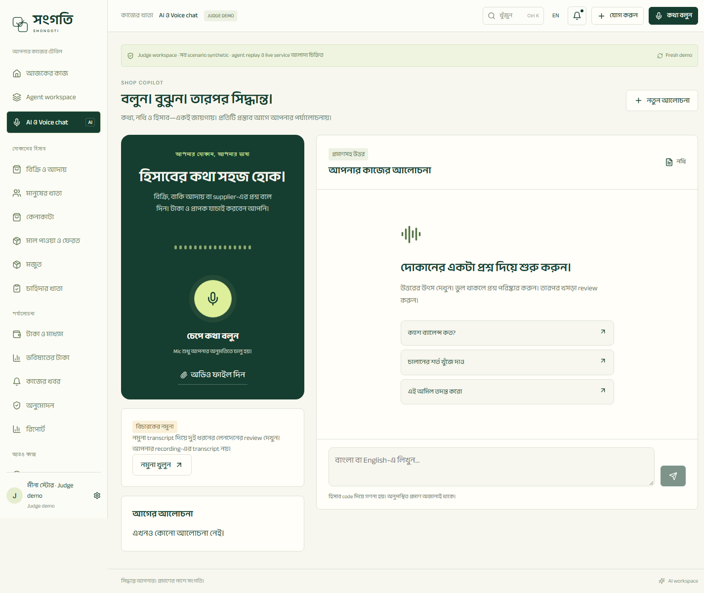 | 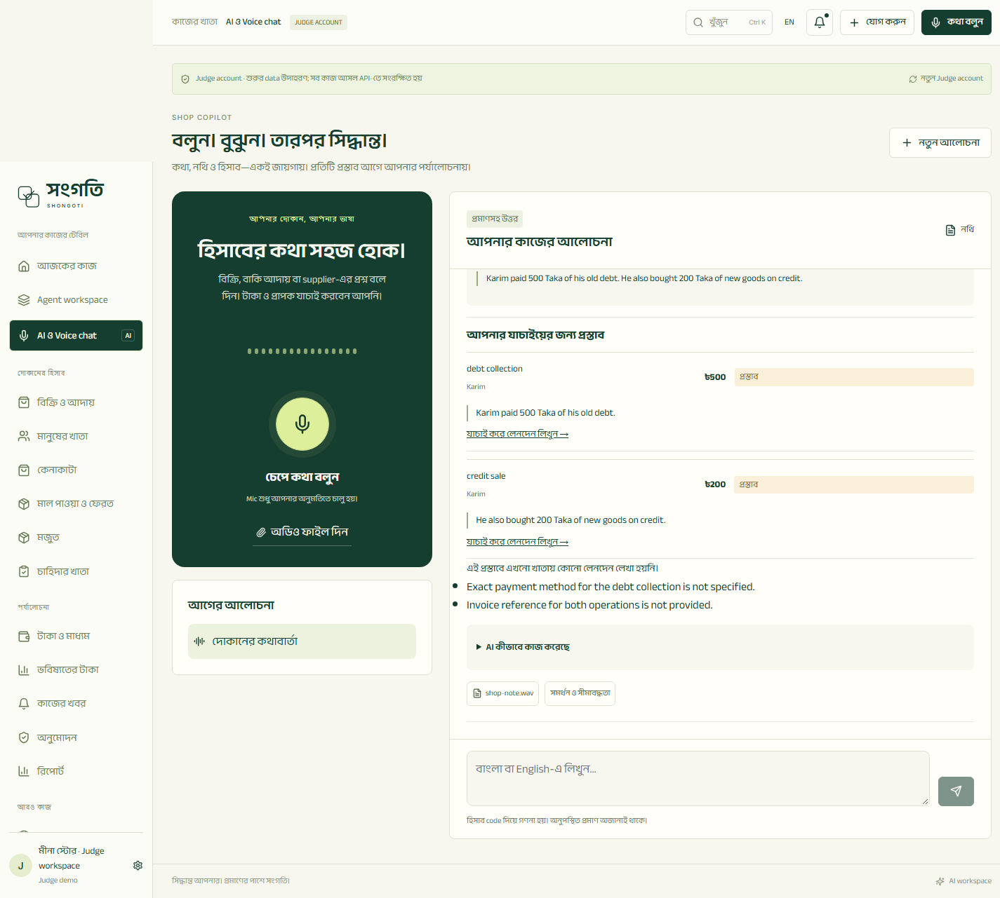 |

---

### 2.5 Daily Commerce: Sales, Collections, People & Scoped Public Customer Portal (`/app/sales`, `/app/people`, `/pay/:token`)

| Guarded Sales & Old-Due Collection (`/app/sales`) | Customer & Supplier Directory (`/app/people`) | Scoped Public Customer Invoice Portal (`/pay/:token`) |
| :---: | :---: | :---: |
|  | 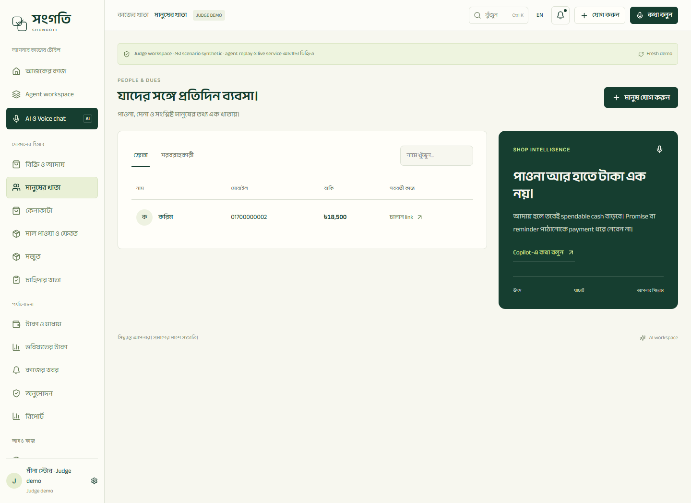 | 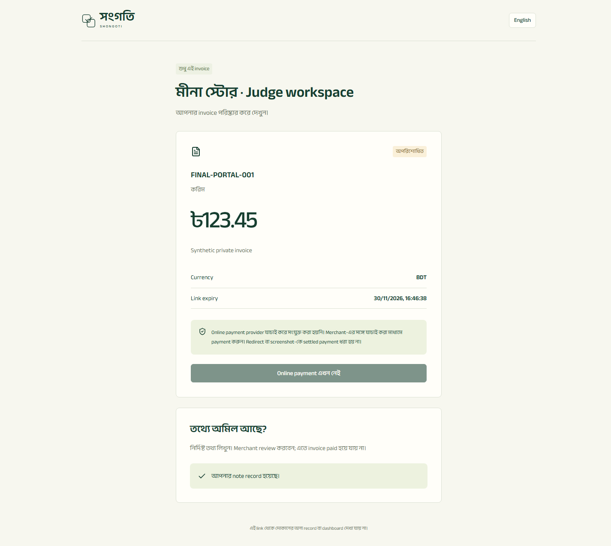 |

---

### 2.6 Procurement, Receiving, Source-Backed Credit Recovery, Inventory & Demand Memory (`/app/buying`, `/app/receiving`, `/app/stock`, `/app/demand`)

* **Buying Desk (`/app/buying`):** Normalizes supplier quotes for the same SKU across base price, pack size, delivery fee, and promotional terms (*"6+1" offers*), capping confidence at `≤ 59` when bonus terms are unverified and checking liquid account feasibility.
* **Receiving & Credit Recovery (`/app/receiving`):** Adds **only usable units (`received - damaged`)** to stock. Shortages and damages create a `suspected` credit note that requires uploading the supplier's original acceptance evidence and explicit owner confirmation before marking `accepted`.
* **Inventory (`/app/stock`) & Demand Memory (`/app/demand`):** Tracks Weighted Average Cost (WAC), reorder signals, CSV bulk import with SKU deduplication, and non-revenue unmet customer demand (*"Remember the sale that didn't happen"*).

| Buying Desk Quote Comparison (`/app/buying`) | Delivery Intake & Credit Recovery (`/app/receiving`) | Source-Backed Supplier Credit Acceptance Modal |
| :---: | :---: | :---: |
|  | 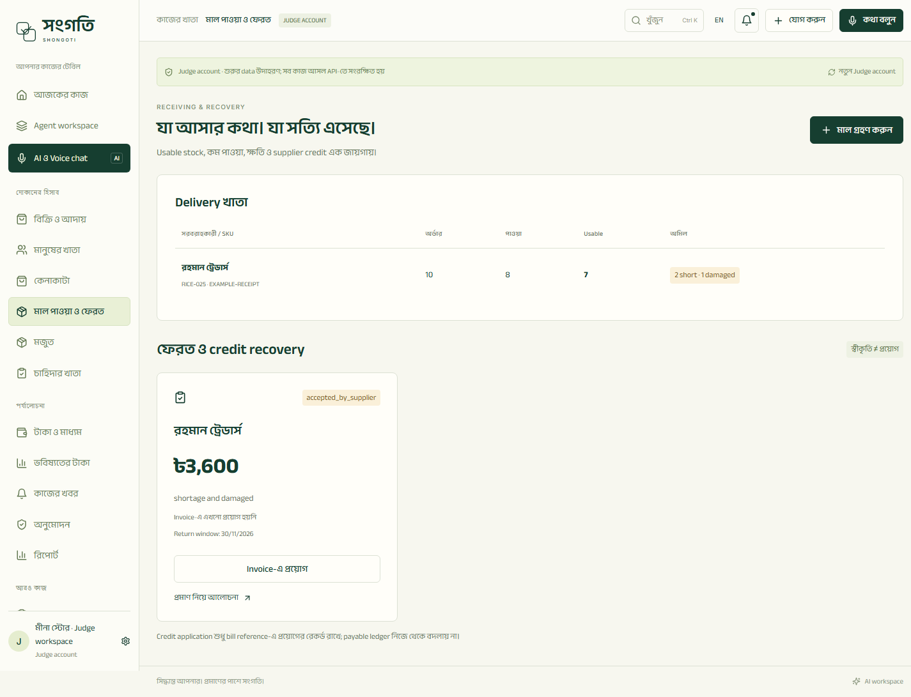 |  |

| Shelf Inventory & CSV Import (`/app/stock`) | Unmet Demand Memory & Reorder Analysis (`/app/demand`) |
| :---: | :---: |
|  |  |

---

### 2.7 Treasury, 7-Day Cash Planner, Actionable Inbox, Approvals & 4 Operating Reports (`/app/money`, `/app/planner`, `/app/inbox`, `/app/actions`, `/app/reports`)

| Multi-Channel Treasury: Cash, bKash, Nagad (`/app/money`) | 7-Day Cash Planning & Decision Lab (`/app/planner`) |
| :---: | :---: |
| 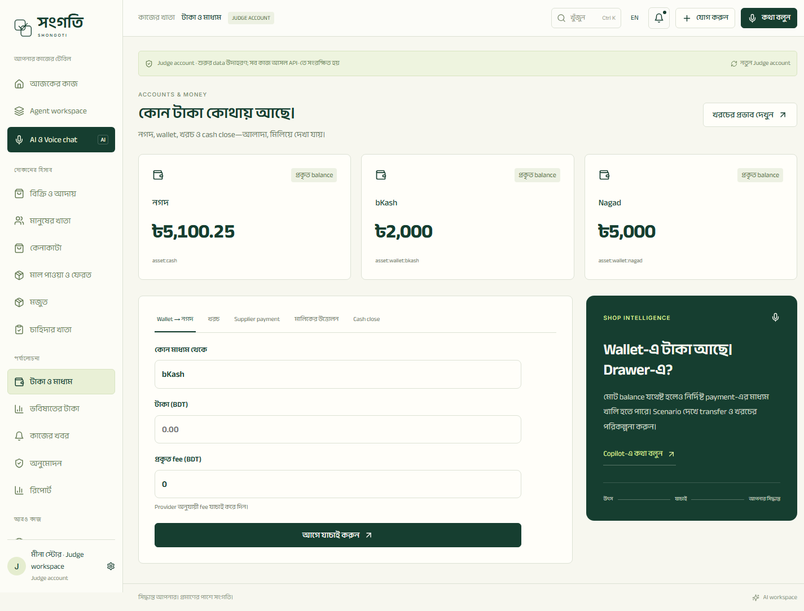 | 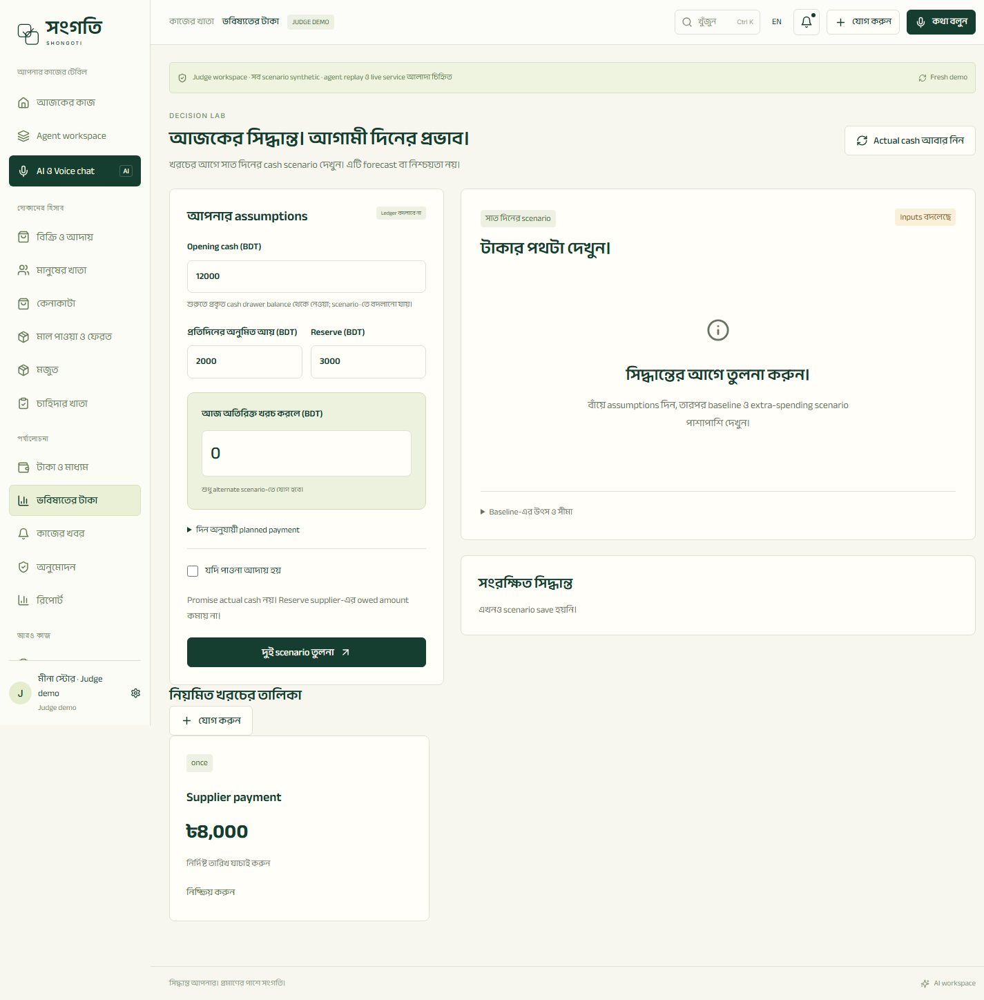 |

| Actionable Inbox & Daily Audio Brief (`/app/inbox`) | Owner Approvals & Duplicate Guard (`/app/actions`) | 4 Separated Operating Statements & CSV Export (`/app/reports`) |
| :---: | :---: | :---: |
|  | 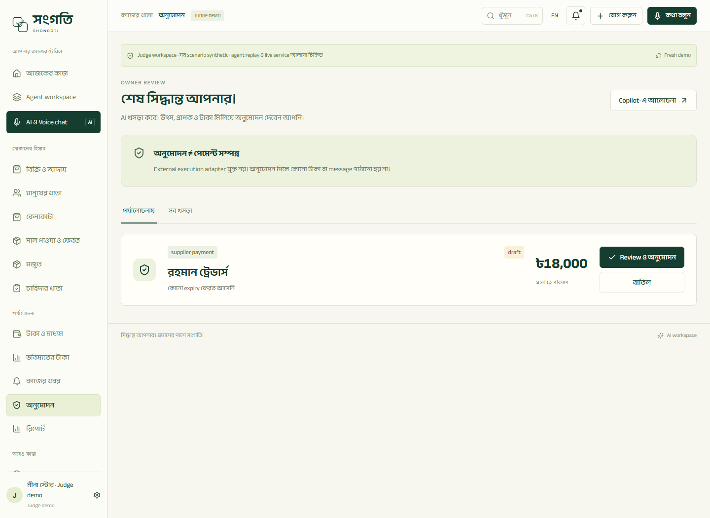 | 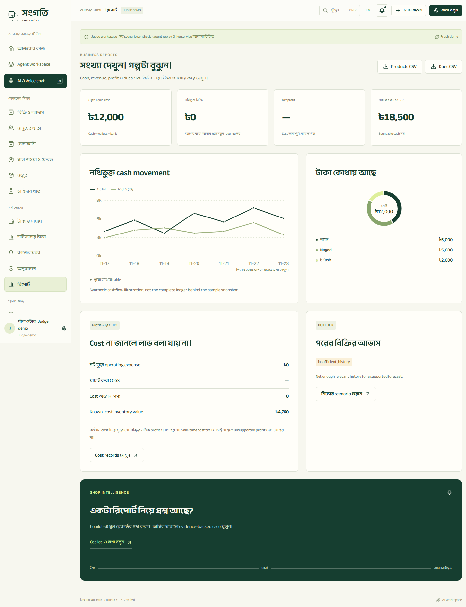 |

---

### 2.8 Everyday Shop Operations, Business Help Desk, Evidence Library, Connections & Judge Scenarios (`/app/operations`, `/app/help`, `/app/evidence`, `/app/connections`, `/app/scenarios`)

| 4 Floor Workflows: Reservations, Crates, Shifts (`/app/operations`) | Bangladesh MSME Compliance & Statute Help Desk (`/app/help`) | Multimodal Evidence Intake, Retry & Hybrid Search (`/app/evidence`) |
| :---: | :---: | :---: |
| 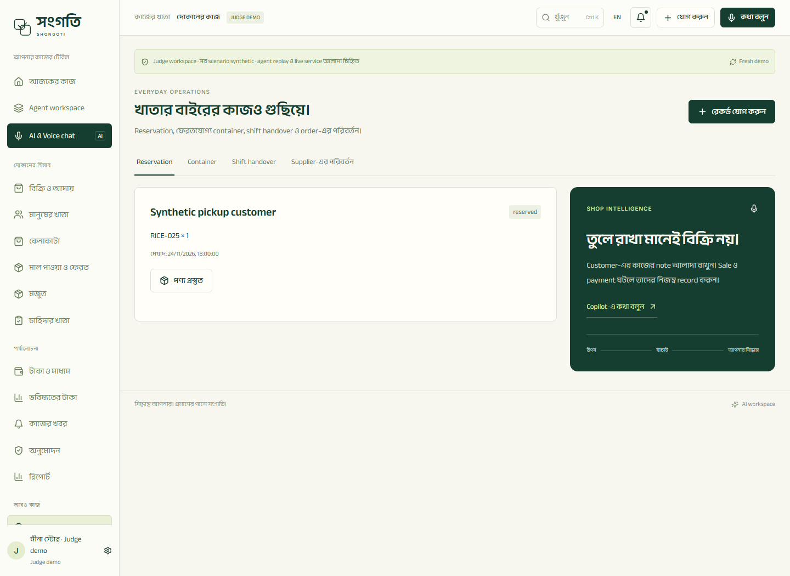 | 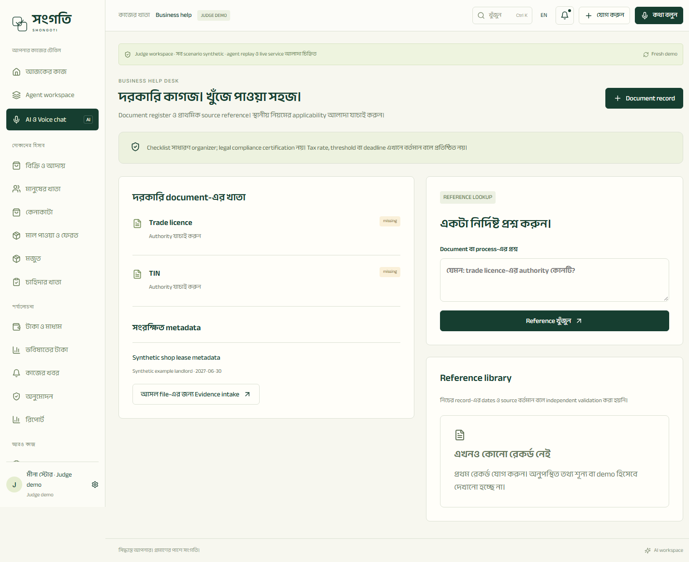 |  |

| Live Provider & Capability Inspector (`/app/connections`) | Workspace Preferences & Accessibility (`/app/settings`) | 7 Interactive Judge Scenarios (`/app/scenarios`) |
| :---: | :---: | :---: |
|  | 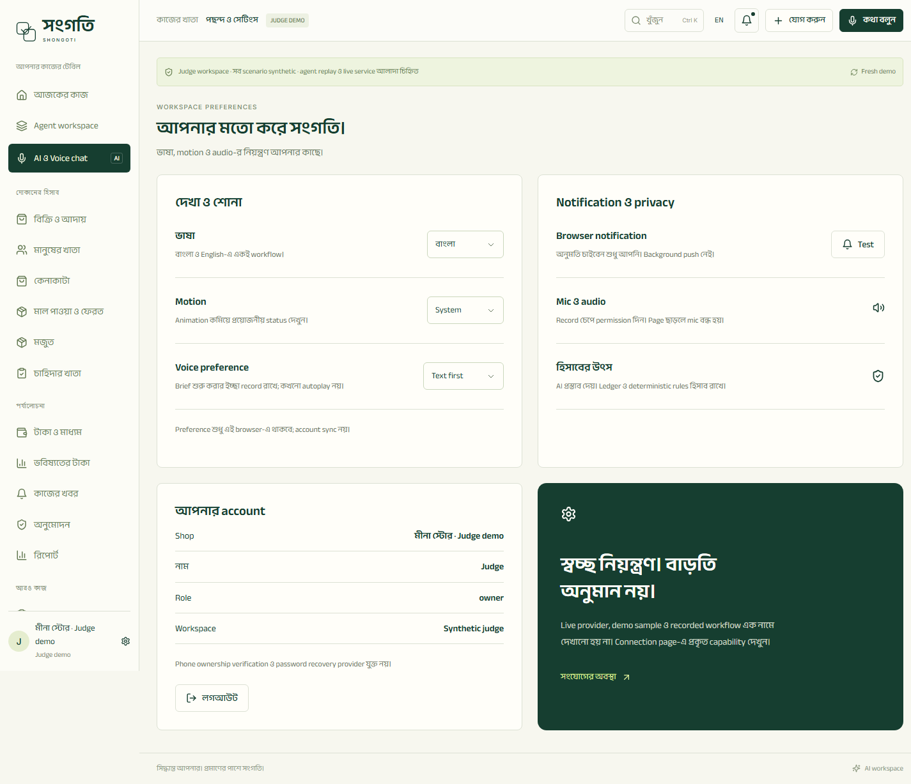 |  |

---

## 3. System Architecture & Multi-Agent Workflow Diagrams

### 3.1 High-Level Modular Monolith & AI Boundary Architecture

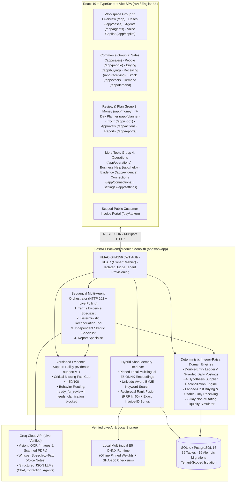
```mermaid
flowchart TB
    subgraph Client["React 19 + TypeScript + Vite SPA (বাংলা / English UI)"]
        UI_Work["Workspace Group 1: Overview (/app) · Cases (/app/cases) · Agents (/app/agents) · Voice Copilot (/app/copilot)"]
        UI_Comm["Commerce Group 2: Sales (/app/sales) · People (/app/people) · Buying (/app/buying) · Receiving (/app/receiving) · Stock (/app/stock) · Demand (/app/demand)"]
        UI_Plan["Review & Plan Group 3: Money (/app/money) · 7-Day Planner (/app/planner) · Inbox (/app/inbox) · Approvals (/app/actions) · Reports (/app/reports)"]
        UI_More["More Tools Group 4: Operations (/app/operations) · Business Help (/app/help) · Evidence (/app/evidence) · Connections (/app/connections) · Settings (/app/settings)"]
        UI_Portal["Scoped Public Customer Invoice Portal (/pay/:token)"]
    end

    subgraph API["FastAPI Backend Modular Monolith (apps/api/app)"]
        Auth["HMAC-SHA256 JWT Auth · RBAC (Owner/Cashier) · Isolated Judge Tenant Provisioning"]
        DetLedger["Deterministic Integer-Paisa Domain Engines\n• Double-Entry Ledger & Guarded Daily Postings\n• 4-Hypothesis Supplier Reconciliation Engine\n• Landed-Cost Buying & Usable-Only Receiving\n• 7-Day Non-Mutating Liquidity Simulator"]
        ConfPolicy["Versioned Evidence-Support Policy (evidence-support-v1)\n• Critical Missing Fact Cap <= 59/100\n• Behavior Routing: ready_for_review | needs_clarification | blocked"]
        HybridRAG["Hybrid Shop Memory Retriever\n• Pinned Local Multilingual E5 ONNX Embeddings\n• Unicode-Aware BM25 Keyword Search\n• Reciprocal Rank Fusion (RRF, k=60) + Exact Invoice-ID Bonus"]
        AgentOrch["Sequential Multi-Agent Orchestrator (HTTP 202 + Live Polling)\n1. Terms Evidence Specialist\n2. Deterministic Reconciliation Tool\n3. Independent Skeptic Specialist\n4. Report Specialist"]
    end

    subgraph Providers["Verified Live AI & Local Storage"]
        Groq["Groq Cloud API (Live Verified)\n• Vision / OCR (Images & Scanned PDFs)\n• Whisper Speech-to-Text (Voice Notes)\n• Structured JSON LLMs (Chat, Extraction, Agents)"]
        ONNX["Local Multilingual E5 ONNX Runtime\n(Offline Pinned Weights + SHA-256 Checksum)"]
        DB[("SQLite / PostgreSQL 16\n35 Tables · 16 Alembic Migrations\nTenant-Scoped Isolation")]
    end

    Client <-->|"REST JSON / Multipart HTTP"| Auth
    Auth --> DetLedger
    Auth --> ConfPolicy
    Auth --> HybridRAG
    Auth --> AgentOrch
    HybridRAG --> ONNX
    HybridRAG --> DB
    AgentOrch --> Groq
    AgentOrch --> DetLedger
    AgentOrch --> ConfPolicy
    DetLedger --> DB
```

### 3.2 Sequential 4-Role Multi-Agent Investigation & Human Review Sequence

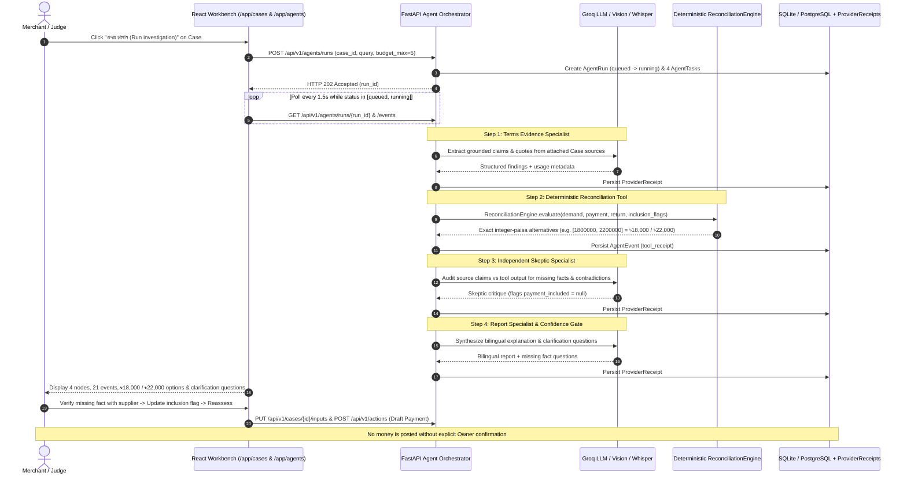
```mermaid
sequenceDiagram
    autonumber
    actor Owner as Merchant / Judge
    participant UI as React Workbench (/app/cases & /app/agents)
    participant API as FastAPI Agent Orchestrator
    participant Groq as Groq LLM / Vision / Whisper
    participant Tool as Deterministic ReconciliationEngine
    participant DB as SQLite / PostgreSQL + ProviderReceipts

    Owner->>UI: Click "তদন্ত চালান (Run investigation)" on Case
    UI->>API: POST /api/v1/agents/runs (case_id, query, budget_max=6)
    API->>DB: Create AgentRun (queued -> running) & 4 AgentTasks
    API-->>UI: HTTP 202 Accepted (run_id)
    
    loop Poll every 1.5s while status in [queued, running]
        UI->>API: GET /api/v1/agents/runs/{run_id} & /events
    end

    Note over API,Groq: Step 1: Terms Evidence Specialist
    API->>Groq: Extract grounded claims & quotes from attached Case sources
    Groq-->>API: Structured findings + usage metadata
    API->>DB: Persist ProviderReceipt #1 + AgentEvent (finding_recorded)

    Note over API,Tool: Step 2: Deterministic Reconciliation Tool
    API->>Tool: ReconciliationEngine.evaluate(demand, payment, return, inclusion_flags)
    Tool-->>API: Exact integer-paisa alternatives (e.g. [1800000, 2200000] = ৳18,000 / ৳22,000)
    API->>DB: Persist AgentEvent (tool_receipt)

    Note over API,Groq: Step 3: Independent Skeptic Specialist
    API->>Groq: Audit source claims vs tool output for missing facts & contradictions
    Groq-->>API: Skeptic critique (flags payment_included = null)
    API->>DB: Persist ProviderReceipt #2 + AgentEvent (skeptic_critique)

    Note over API,Groq: Step 4: Report Specialist & Confidence Gate
    API->>Groq: Synthesize bilingual explanation & clarification questions
    Groq-->>API: Bilingual report + missing fact questions
    API->>DB: Persist ProviderReceipt #3 + Cap Confidence <= 59/100 (waiting_user)

    UI-->>Owner: Display 4 nodes, 21 events, ৳18,000 / ৳22,000 options & clarification questions
    Owner->>UI: Verify missing fact with supplier -> Update inclusion flag -> Reassess
    UI->>API: PUT /api/v1/cases/{id}/inputs & POST /api/v1/actions (Draft Payment)
    Note over Owner,DB: No money is posted without explicit Owner confirmation
```

---

## 4. Complete Database Entity-Relationship (ER) Diagram

Shongoti's persistence layer ([apps/api/app/persistence/models.py](apps/api/app/persistence/models.py)) comprises **35 normalized tables across 16 Alembic migrations** ([apps/api/alembic/versions/](apps/api/alembic/versions/)). Every tenant-owned record enforces `tenant_id` isolation and integer-paisa (`_paisa`) monetary columns.


```mermaid
erDiagram
    TENANTS ||--o{ USERS : "isolates"
    USERS ||--o| USER_CREDENTIALS : "authenticates"
    TENANTS ||--o{ ACCOUNTS : "owns_chart_of_accounts"
    TENANTS ||--o{ JOURNAL_ENTRIES : "records_double_entry"
    JOURNAL_ENTRIES ||--|{ POSTINGS : "contains_balanced_lines"
    ACCOUNTS ||--o{ POSTINGS : "debits_or_credits"
    TENANTS ||--o{ DAILY_SNAPSHOTS : "tracks_drawer_close"
    TENANTS ||--o{ OBLIGATIONS : "tracks_payables"
    OBLIGATIONS ||--o{ ALLOCATIONS : "allocates_payments"
    TENANTS ||--o{ AUDIT_LOGS : "records_audit_trail"

    TENANTS ||--o{ PARTIES : "manages_customers_suppliers"
    TENANTS ||--o{ PRODUCTS : "catalogs_skus"
    PRODUCTS ||--o{ STOCK_MOVEMENTS : "logs_inventory_deltas"
    PARTIES ||--o{ CUSTOMER_PORTAL_TOKENS : "scopes_public_invoice"
    PARTIES ||--o{ PURCHASE_DRAFTS : "supplies"
    PRODUCTS ||--o{ PURCHASE_DRAFTS : "reorders"
    PARTIES ||--o{ RECURRING_COMMITMENTS : "receives_scheduled"

    TENANTS ||--o{ EVIDENCE : "stores_private_files"
    EVIDENCE ||--o{ EXTRACTED_CLAIMS : "yields_ocr_whisper_claims"
    TENANTS ||--o{ DOCUMENT_CHUNKS : "indexes_e5_bm25_rag"
    TENANTS ||--o{ PROVIDER_RECEIPTS : "audits_groq_calls"

    TENANTS ||--o{ CASES : "investigates"
    CASES ||--o{ CASE_VERSIONS : "snapshots_state"
    CASES ||--o{ EVIDENCE_CLAIMS : "evaluates_facts"
    CASES ||--o{ CONFIDENCE_ASSESSMENTS : "scores_evidence_support_v1"
    CASES ||--o{ AGENT_RUNS : "spawns_investigation"
    AGENT_RUNS ||--|{ AGENT_TASKS : "executes_4_specialists"
    AGENT_RUNS ||--|{ AGENT_EVENTS : "streams_receipts"
    AGENT_TASKS ||--o{ AGENT_EVENTS : "emits"

    TENANTS ||--o{ COPILOT_SESSIONS : "hosts_conversations"
    COPILOT_SESSIONS ||--o{ COPILOT_MESSAGES : "stores_turns_and_voice"
    ACTIONS ||--o{ COPILOT_MESSAGES : "links_action_draft"
    USERS ||--o{ ACTIONS : "creates_or_approves"

    TENANTS ||--o{ SUPPLIER_OFFERS : "collects_quotes"
    SUPPLIER_OFFERS ||--o{ BUYING_COMPARISONS : "ranks_landed_cost"
    TENANTS ||--o{ GOODS_RECEIPTS : "intakes_deliveries"
    GOODS_RECEIPTS ||--o{ CREDIT_NOTES : "flags_shortage_damage"
    TENANTS ||--o{ UNMET_DEMANDS : "remembers_missed_sales"
    TENANTS ||--o{ STOCKOUT_PERIODS : "tracks_zero_stock_windows"

    TENANTS ||--o{ SCENARIOS : "simulates_7day_cash"
    TENANTS ||--o{ NOTIFICATIONS : "alerts_inbox"
    TENANTS ||--o{ CUSTOMER_RESERVATIONS : "holds_picking_lists"
    PARTIES ||--o{ RETURNABLE_CONTAINERS : "tracks_crate_deposits"
    TENANTS ||--o{ SHIFT_HANDOVERS : "reconciles_cashier_shifts"
    TENANTS ||--o{ BUSINESS_DOCUMENTS : "registers_licenses"

    TENANTS {
        string id PK
        string name
        string currency "BDT"
        boolean is_demo
        datetime created_at
    }
    USERS {
        string id PK
        string tenant_id FK
        string phone
        string role "owner | cashier | accountant"
        boolean is_active
    }
    ACCOUNTS {
        string id PK
        string tenant_id FK
        string code "asset:cash | asset:wallet:bkash | ..."
        string type "asset | liability | equity | revenue | expense"
        int current_balance_paisa
        int version
    }
    JOURNAL_ENTRIES {
        string id PK
        string tenant_id FK
        string entry_number
        string event_id "Idempotency key"
        int version
    }
    POSTINGS {
        string id PK
        string journal_entry_id FK
        string account_id FK
        string direction "debit | credit"
        int amount_paisa
    }
    PARTIES {
        string id PK
        string tenant_id FK
        string name
        string party_type "customer | supplier"
        int current_due_paisa
    }
    PRODUCTS {
        string id PK
        string tenant_id FK
        string name
        string sku
        int quantity_on_hand
        int cost_price_paisa "WAC (nullable)"
        int selling_price_paisa
        int reorder_threshold
    }
    EVIDENCE {
        string id PK
        string tenant_id FK
        string filename
        string content_sha256
        string source_type "pdf | image | audio | text"
        string status "uploaded | extracted | failed | reviewed"
    }
    EXTRACTED_CLAIMS {
        string id PK
        string evidence_id FK
        string party_name
        string invoice_ref
        int amount_paisa
        boolean is_reviewed "Protected on retry"
        int corrected_amount_paisa
    }
    DOCUMENT_CHUNKS {
        string id PK
        string tenant_id FK
        string document_id
        text content
        text embedding_json "Multilingual E5 384-d"
        boolean is_revoked
    }
    CASES {
        string id PK
        string tenant_id FK
        string case_type "reconciliation | offer | ..."
        string status "open | waiting_user | ready_for_review"
        int current_version
    }
    CONFIDENCE_ASSESSMENTS {
        string id PK
        string case_id FK
        string policy_version "evidence-support-v1"
        int score "Capped <= 59 on missing critical fact"
        string band "strong | review | limited | unavailable"
        string readiness
    }
    AGENT_RUNS {
        string id PK
        string case_id FK
        string status "queued | running | waiting_user | completed"
        int budget_calls_max
        int budget_calls_used
    }
    PROVIDER_RECEIPTS {
        string id PK
        string tenant_id FK
        string capability
        string provider "groq"
        string model
        string request_fingerprint
        int input_tokens
        int output_tokens
        int latency_ms
    }
    GOODS_RECEIPTS {
        string id PK
        string tenant_id FK
        string sku
        int ordered_quantity
        int received_quantity
        int damaged_quantity
        int shortage_quantity
    }
    CREDIT_NOTES {
        string id PK
        string receipt_id FK
        string claim_reason "shortage | damaged"
        int amount_paisa
        string status "suspected | accepted_by_supplier | applied_to_bill"
        string applied_invoice_ref
    }
    ACTIONS {
        string id PK
        string tenant_id FK
        string action_type
        string recipient
        int amount_paisa
        string status "draft | approved | completed | cancelled"
        string idempotency_key
    }
```

---

## 5. Complete Feature & Route Guide (বাংলা + English)

Every screen in Shongoti supports instant **বাংলা ↔ English** toggling while preserving the exact same underlying workflow and database state.

### Group 0: Public Entry, Auth & Onboarding

| Route | Menu / Screen Name | What It Is & What It Offers (বাংলা ও English) | How to Use It (Step-by-Step) |
| :--- | :--- | :--- | :--- |
| `/` | **Landing Page**<br/>পাবলিক ল্যান্ডিং পেজ | Product overview, evidence-first philosophy, bilingual toggle (`বাংলা`/`EN`), and direct links to sign in or launch a Judge workspace. | Open `/`, toggle language in the top header, and click **শুরু করুন (Get started)** or **লগইন (Sign in)**. |
| `/login`<br/>`/register`<br/>`/demo` | **Auth & Judge Entry**<br/>লগইন, রেজিস্ট্রেশন ও Judge Account | • **Merchant Auth:** Real password + HMAC-SHA256 JWT multi-tenant authentication.<br/>• **Isolated Judge Account:** One-click provisioning of a fresh isolated tenant seeded with sample records that run on real database tables and live Groq inference. | Click **Judge workspace খুলুন** on `/login` for instant evaluation with sample cases, or register a new shop on `/register`. |
| `/onboarding` | **Verified Opening Funds**<br/>যাচাই করা শুরুর টাকা | Records initial Cash, bKash, and Nagad balances for a newly registered shop as a balanced journal entry against `equity:owner_capital`. | Enter opening Cash, bKash, and Nagad BDT amounts and confirm the review dialog. |

### Sidebar Group 1: আপনার কাজের টেবিল (YOUR WORKSPACE)

| Route | Menu Name (বাংলা / EN) | What It Is & What It Offers | How to Use It (Step-by-Step) |
| :--- | :--- | :--- | :--- |
| `/app` | **আজকের কাজ**<br/>Overview | Daily command center displaying:<br/>1. **হাতে আছে (Available funds):** Cash + Wallets only (excludes promises).<br/>2. **মানুষের কাছে পাওনা (Customer receivables)**.<br/>3. **Supplier-এর পাওনা (Supplier dues)**.<br/>4. **Review-এর কাজ (Review queue)**.<br/>Plus 7-day cashflow chart, Cash/Nagad/bKash mix, and the 4-step **Shongoti at Work** agent rail. | Check spendable funds at a glance, click **খুলুন (Open)** on any pending decision row, or click **+ প্রমাণ যোগ করুন (Add evidence)**. |
| `/app/cases`<br/>`/app/cases/:caseId` | **Agent workspace**<br/>(Case Register & 3-Source Stage) | Resolves supplier billing disputes by comparing **Supplier Demand**, **Payment Receipt**, and **Accepted Return** side-by-side. Separates applicability checkboxes (`payment_applicable`, `return_accepted`) from prior inclusion (`true` / `false` / `unknown`). | Open a case or create **+ নতুন case**, inspect the 3 source tabs, verify/update prior inclusion dropdowns, click **Reassess**, and generate an idempotent payment draft only when a single payable amount is established. |
| `/app/agents`<br/>`/app/agents/:runId` | **Agent workspace**<br/>(Multi-Agent Runner) | Asynchronous HTTP 202 investigation pipeline with live 1.5s polling, call budget tracking (`3 / 6`), step replay, and verifiable receipts across 4 sequential roles: **Terms Evidence → Reconciliation Tool → Skeptic → Report**. | Click **তদন্ত চালান (Run investigation)** inside a case or `/app/agents`, click any specialist node to inspect its raw JSON model/tool receipt, or click **Recorded ধাপ replay**. |
| `/app/copilot` | **AI ও Voice chat [AI]**<br/>AI & Voice chat | Live microphone voice recorder (60s waveform) + audio uploader transcribed by **Groq Whisper**, source-grounded Q&A with citations, TTS read-aloud, and **Compound Voice Transaction Splitting** (separates old debt collection from new credit sales spoken in one sentence). | Tap the mic (**চেপে কথা বলুন**) or upload audio / type a shop question, preview your clip, click **প্রতিলিপি করুন (Transcribe)**, and inspect the split operation cards. |
| `/app/copilot/review/:msgId/:opIdx` | **Review AI Interpretation**<br/>প্রস্তাব থেকে যাচাই করা রেকর্ড | Dedicated human verification gate for Copilot-proposed operations. Displays the exact transcript quote, audio link, BDT amount, registered party dropdown, payment channel (`cash`, `bkash`, `nagad`), and owner confirmation checkbox. Protected by a unique `source_hash`. | Click **Review & record** on any Copilot proposal, select the registered customer/supplier and account channel, check the confirmation box, and submit once. |

### Sidebar Group 2: দোকানের হিসাব (COMMERCE)

| Route | Menu Name (বাংলা / EN) | What It Is & What It Offers | How to Use It (Step-by-Step) |
| :--- | :--- | :--- | :--- |
| `/app/sales` | **বিক্রি ও আদায়**<br/>Sales & collections | Strict two-tab daily register:<br/>• **নতুন বিক্রি (New sale):** Cash, Credit, and Split (partial cash + credit) sales with atomic SKU stock deduction and oversell prevention.<br/>• **পুরোনো বাকি আদায় (Collect due):** Collects existing customer receivables (`Not new revenue`) without inflating sales revenue. | Choose **New sale** or **Collect due**, enter BDT amount, select customer/SKU, click **Review**, and confirm in the retry-safe modal. |
| `/app/people`<br/>`/pay/:token` | **মানুষের খাতা**<br/>People & Public Invoice Portal | Customer (`ক্রেতা`) & Supplier (`সরবরাহকারী`) ledger with balanced opening dues and a **Scoped Public Invoice Link Generator** (`/pay/:token`). Customers opening `/pay/:token` see only that single invoice (`THIS INVOICE ONLY`) and can submit persistent dispute/review notes. | Add customers/suppliers via **+ মানুষ যোগ করুন**, or select a customer, enter an invoice number & amount, generate `/pay/:token`, and open it to test customer dispute persistence. |
| `/app/buying` | **কেনাকাটা**<br/>Purchasing (Buying Desk) | Compares competing supplier quotes for the same SKU across base price, pack size, delivery fee, and promotional terms (*"6+1" offers*). Computes exact integer-paisa **Landed Unit Cost**, caps confidence at `≤ 59` on unverified bonus conditions, and checks liquid cash feasibility. | Enter target SKU (e.g., `RICE-025`) and quantity, click **Compare**, review landed unit cost & cash feasibility badges, or add quotes via **+ Quote যোগ করুন**. |
| `/app/receiving` | **মাল পাওয়া ও ফেরত**<br/>Receiving & credits | Delivery intake & credit recovery tracker:<br/>• Adds **only usable units (`received - damaged`)** to inventory stock.<br/>• Automatically creates a `suspected` credit note for shortages/damages without prematurely cutting payables.<br/>• **Review Supplier Acceptance Modal:** Requires uploading the supplier's original acceptance source + owner confirmation before marking a credit `accepted` and linking it once to a bill. | Click **Record delivery** for a registered SKU, enter ordered/received/damaged counts, then click **Review supplier acceptance** on the resulting credit note, upload the proof file, confirm, and apply to an invoice reference. |
| `/app/stock` | **মজুত**<br/>Inventory | SKU catalog with Weighted Average Cost (WAC / গড় ক্রয়মূল্য), cost-completeness tracking, reorder thresholds, lead-time cover days, and **CSV Preview & Bulk Import** with SKU deduplication. | Add individual products via **+ পণ্য যোগ করুন**, or click **CSV preview** to inspect and bulk-import a `.csv` product catalog. |
| `/app/demand` | **চাহিদার খাতা**<br/>Demand memory | Logs unmet customer requests (*"যে বিক্রিটা হয়নি, সেটাও মনে রাখুন"*) caused by stockouts or uncarried items without booking fake revenue or receivables. Computes factual SKU reorder analyses. | Click **+ চাহিদা লিখুন (Log a request)** to record a missed sale, then click **Analyze** on any linked SKU to inspect total lost units and stockout windows. |

### Sidebar Group 3: পর্যালোচনা (REVIEW & PLAN)

| Route | Menu Name (বাংলা / EN) | What It Is & What It Offers | How to Use It (Step-by-Step) |
| :--- | :--- | :--- | :--- |
| `/app/money` | **টাকা ও মাধ্যম**<br/>Accounts & money | Multi-channel treasury across **Cash (নগদ)**, **bKash**, and **Nagad** supporting 5 guarded operations:<br/>1. **Wallet → Cash Transfer** (with explicit cash-out fee accounting).<br/>2. **Operating Expense** (rejects unfunded outflows).<br/>3. **Owner Withdrawal** (equity draw separated from expenses).<br/>4. **Supplier Payment** (reduces payable from chosen channel).<br/>5. **Daily Cash Close** (reconciles physical drawer count vs system cash). | Select one of the 5 operation tabs, enter amount/channel/party, click **Review**, and confirm the balanced double-entry posting. |
| `/app/planner` | **ভবিষ্যতের টাকা**<br/>Cash planning | Non-mutating **7-Day Liquidity Simulator & Decision Lab** (*"আজ কিনলে বৃহস্পতিবার টাকা থাকবে?"*). Simulates opening cash, daily receipts, 7-day outflows, safety reserve target, Day-1 extra purchase, and toggleable **Conditional Customer Promises**. Pinpoints exact **Reserve Breach Days** and **Cash Shortfall Days**, and manages **Recurring Commitments** (rent, utilities, payroll). | Adjust Day-1 extra expense or toggle a conditional customer promise, click **Simulate**, compare baseline vs scenario ending balances, and save named scenarios. |
| `/app/inbox` | **কাজের খবর**<br/>Actionable Inbox | Priority-sorted operational alerts (unresolved receipts, unapplied supplier credits, return deadlines, cash constraints) with deep links, **4-hour Snooze**, **Resolve**, and a **Daily Bangla/English Executive Audio Brief** (with TTS playback & transcript). | Filter between **খোলা কাজ (Open)** and **সব (All)**, click **শুনুন (Listen)** on the Daily Brief, or snooze/resolve alerts. |
| `/app/actions` | **অনুমোদন**<br/>Approvals | Human-in-the-loop governance queue for case/AI-prepared action drafts (e.g., reconciled supplier payment drafts). Enforces RBAC (Cashiers cannot approve owner actions), blocks duplicate idempotency keys, and separates internal approval from external payment execution. | Select an active draft, verify recipient, source refs, and amount, check the owner confirmation box, and approve or cancel. |
| `/app/reports` | **রিপোর্ট**<br/>Business Reports | **Four Strictly Separated Operating Statements:**<br/>1. **Actual Liquid Cash** (Cash + Wallets + Bank).<br/>2. **Accrual Profit Statement** (Revenue, COGS, Gross Margin, Expenses — *automatically suppresses profit claims when sold SKUs lack cost prices*).<br/>3. **Inventory Valuation** (Valued vs uncosted SKUs).<br/>4. **Dues Statement** (Customer receivables vs Supplier payables).<br/>Includes **Cold-Start Gated Sales Forecast** (`>= 14 days` history) and live **Products CSV** & **Dues CSV** downloads. | Inspect the 4 separate financial stories and click **Products CSV** or **Dues CSV** to download real database exports. |

### Sidebar Group 4: আরও কাজ (MORE TOOLS)

| Route | Menu Name (বাংলা / EN) | What It Is & What It Offers | How to Use It (Step-by-Step) |
| :--- | :--- | :--- | :--- |
| `/app/operations` | **দোকানের কাজ**<br/>Operations | Four daily shop-floor utilities:<br/>1. **Customer Reservations:** 24h picking lists & stock checks without premature revenue booking.<br/>2. **Returnable Containers:** Crate/jar/cylinder issue & return counts + refundable security deposits separated from sales revenue.<br/>3. **Shift Handovers:** Cashier shift drawer close with non-accusatory discrepancy hypotheses.<br/>4. **Supplier Change Impact:** Evaluates price jumps or lead-time delays on a specific order. | Switch across the 4 tabs to log a customer reservation, record a crate/bottle movement, close a cashier shift, or calculate supplier price-change impact. |
| `/app/help` | **Business help**<br/>বিজনেস হেল্প ডেস্ক | Tenant-isolated **Business Document Register** (Trade License, TIN, BIN/VAT, Shop Lease, Fire License) with expiry alerts, a **Grocery Compliance Checklist**, and **Statute-Cited Guidance** grounded in Bangladesh acts (*Local Government Act 2009, VAT Act 2012, Income Tax Act 2023, Transfer of Property Act 1882*) with explicit legal-advice disclaimers. | Register shop licenses with issue/expiry dates via **+ Document record**, review the compliance checklist, or query the statutory guidance desk. |
| `/app/evidence`<br/>`/app/evidence/:id` | **প্রমাণ যোগ করুন**<br/>Evidence intake & Hybrid Search | Multimodal document/media vault (`.pdf`, scanned PDF, `.png/.jpg/.webp`, `.txt`, `audio/*` up to 10 MB) + **Live Groq Extraction** + **Retry Preservation** (`Reprocess` reuses the same `evidence_id` and never overwrites human-reviewed claims) + **Hybrid Shop Memory Search** (local Multilingual E5 ONNX + Unicode BM25 + RRF `k=60`). | Upload a bill, photo, PDF, or audio note via **নথি দিন (Upload evidence)**, inspect/correct extracted claims, or search invoice terms in Bangla or English. |
| `/app/connections` | **সংযোগ**<br/>Connections | Live capability status inspector (`/api/v1/workbench/capabilities`) distinguishing verified live capabilities (`available`: Groq Multimodal AI, Multilingual E5 Semantic Search, Multi-Agent Runner, Local File/CSV Storage) from deferred external connectors (`not_configured`: Online Payment Gateway & SMS/WhatsApp Sender). Never exposes API keys in the browser. | Open `/app/connections` and click **অবস্থা দেখুন (Refresh status)** to audit live runtime capabilities. |
| `/app/settings` | **পছন্দ ও সেটিংস**<br/>Settings | Instant **বাংলা / English** language selector, **Reduced Motion** accessibility preference (`system`, `reduce`, `full`), Voice playback preference, Browser Test Notification trigger, plus global topbar **`Ctrl + K` Quick Search** and **`+ যোগ করুন` Quick-Add** modals. | Toggle language or reduced motion, test browser notifications, or press `Ctrl + K` from any page to jump across routes. |
| `/app/scenarios` | **Judge scenarios**<br/>জাজ সিনারিও লাইব্রেরি | Seven interactive, end-to-end business dilemmas (Double-deducted supplier payment, Thursday cash crunch, *"6+1"* offer terms, 10 ordered vs 8 received with 1 damaged, Duplicate payment block, Notice with uncertain deadline, Compound voice transaction) wired to real persistent APIs. | Open `/app/scenarios` and click **Explore করুন (Explore scenario)** on any card to jump directly into that live workflow. |

---

## 6. Local Setup, Running the App & Verification Suite

### 6.1 Prerequisites
* **Node.js** (v20+) & **pnpm** (`pnpm.cmd` on Windows)
* **Python 3.12** & **uv** (`apps/api/.venv`)
* Local `.env` at repository root (copied from `.env.example`) with your `GROQ_API_KEY` (never committed to Git).

### 6.2 Install, Migrate, Prepare Semantic Model & Start Dev Servers

```powershell
# 1. Install JavaScript workspace packages
pnpm.cmd install --frozen-lockfile

# 2. Install FastAPI backend into the Python 3.12 virtual environment
# (If apps/api/.venv does not exist yet, create it first: uv venv --python 3.12 apps/api/.venv)
uv pip install --python apps/api/.venv/Scripts/python.exe -e apps/api

# 3. Apply all 16 Alembic database migrations
pnpm.cmd db:migrate

# 4. Prepare the pinned local Multilingual E5 ONNX semantic model (one-time download into ignored local data)
node scripts/run-python.js scripts/setup-semantic-model.py

# 5. Start the concurrent Web (http://127.0.0.1:5173) and FastAPI (http://127.0.0.1:8000) servers
pnpm.cmd dev
```

### 6.3 Run the Verification & Test Suites

```powershell
# Run the complete backend pytest suite (offline deterministic + SQLite concurrency/race checks)
node scripts/run-python.js -m pytest apps/api/tests/ -q -p no:cacheprovider

# Run frontend Vitest unit & workflow tests
pnpm.cmd test:web

# Build production TypeScript/Vite assets
pnpm.cmd build

# Run real headless Chrome end-to-end workflow & 21-route x 3-viewport (360/768/1440px) verification
node scripts/check-real-workflows-browser.mjs
```

---

## 7. Truthful Integration & Capability Boundary Matrix

In compliance with our engineering honesty rules ([AGENTS.md](AGENTS.md) & [docs/REAL_WORKFLOW_HANDOFF.md](docs/REAL_WORKFLOW_HANDOFF.md)):

| Capability / Subsystem | Current Status | Verification Evidence |
| :--- | :---: | :--- |
| **Multi-Tenant Auth, Judge Account & Double-Entry Paisa Ledger** | **Live & Verified** | `JR-01` & `JR-04` ([Report](docs/evidence/real-workflow/JR-04/REPORT.md)) — File-backed SQLite concurrency, retry-key idempotency, unfunded outflow rejection. |
| **Groq Multimodal Inference (Text, Vision OCR, Native/Scanned PDF, Whisper Audio, Grounded Chat)** | **Live & Verified** | `JR-02` ([Evidence](docs/evidence/real-workflow/JR-02/)) — Genuine unseen synthetic files & provider receipts stored in `provider_receipts`. |
| **Sequential 4-Role Multi-Agent Investigation & Deterministic Reconciliation** | **Live & Verified** | `JR-03` ([Evidence](docs/evidence/real-workflow/JR-03/)) — 3 genuine Groq calls + exact `ReconciliationEngine.evaluate` tool receipt + live HTTP 202 polling. |
| **Hybrid RAG Memory (Local Pinned Multilingual E5 ONNX + Unicode BM25 + RRF `k=60`)** | **Live & Verified** | `JR-03` ([Evidence](docs/evidence/real-workflow/JR-03/)) — Verified on Bangla & English synthetic paraphrases with exact invoice-ID priority. |
| **Online Payment Gateway (SSLCOMMERZ Sandbox / Live Checkout)** | **Deferred by Owner (Fails Closed)** | Owner confirmed no sandbox account is currently available (23 Nov 2026). Synthetic checkout URLs were removed; endpoints fail closed until `SSLCOMMERZ_STORE_ID` & `SSLCOMMERZ_STORE_PASSWD` are configured. |
| **External SMS / WhatsApp Delivery & Phone OTP Recovery** | **Deferred (Drafts Only)** | No verified external sender/account configured. Reminder drafts are stored as internal drafts, never presented as delivered messages. |
| **Cloud Bangla Text-to-Speech (TTS)** | **Browser Voice / Transcript Fallback** | Groq Whisper handles Speech-to-Text transcription; browser playback uses installed matching-language Web Speech voices with full written transcript fallback. |

---

## 8. Key Documentation & Evidence Index

* **[SHONGOTI_COMPLETE_FEATURE_GUIDE_BN_EN.pdf](SHONGOTI_COMPLETE_FEATURE_GUIDE_BN_EN.pdf)** — Complete 20-page bilingual (**বাংলা + English**) feature manual, step-by-step usage guide, and presentation cheat-sheet with 26 embedded screenshots.
* **[docs/REAL_WORKFLOW_HANDOFF.md](docs/REAL_WORKFLOW_HANDOFF.md)** — Authoritative handoff for the real merchant & judge workflow repair (`JR-01` through `JR-04`).
* **[docs/real-workflow-progress.json](docs/real-workflow-progress.json)** — Machine-readable checkpoint tracker with published Git milestone SHAs and receipts.
* **[plan.md](plan.md)** & **[EXTENSION_PLAN.md](EXTENSION_PLAN.md)** — Original Phase 00–12 domain contract and additive Phase 13–26 extension specification.
* **[docs/DECISIONS.md](docs/DECISIONS.md)** & **[docs/INTEGRATIONS.md](docs/INTEGRATIONS.md)** — Architectural Decision Records (ADRs) and external provider boundary definitions.

---

## 9. Team & Authors

**Team:** Quintessence Minus Infinity
* **Sakibul Hassan Shovon**
* **Sabbir Ahmed**
* **Sanjid Talukder**

**Repository:** `https://github.com/sakibul-shovon/Shongoti.git`
